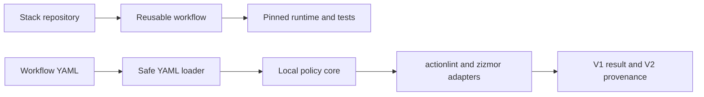

# #24 ci-cd-templates

**Benchmark:** `104.945 ms` median scan latency across `3` measured runs after `1` warmup.

**Correctness gate:** `5` reusable workflows, `6` workflow files scanned, `0` template findings, and `7/7` expected findings detected in the unsafe policy fixtures.

**Benchmark metric:** `scan_time_ms` measures one deterministic pass over the policy fixtures and all reusable workflow files; `findings` and `template_findings` are correctness gates.

**Proves:** one repository can execute and govern reusable GitHub Actions pipelines for Python, Go, Node, JVM/Gradle, and Terraform while keeping the security gate offline, deterministic, and free of credentials.

| Result | Value |
|---|---:|
| Median scan latency | `104.945 ms` |
| Range | `103.531-152.502 ms` |
| Scanned files | `9` (`3` fixtures + `6` workflows) |
| Unsafe-fixture findings | `7/7` |
| Template findings | `0` |

The [V1 result](benchmarks/results/guardrails-baseline.json) and [V2 publication record](benchmarks/publication/guardrails-baseline-v2.json) bind these numbers to source commit `8bfd94a1a8fd6186b717bc7be53d61e92d419b2d` and image digest `sha256:c075a917595faf3e84c5189306eb59c422e051cabaefbc6ea7f75b46d58ae70f`.

## Reusable Workflows

| Workflow | Runtime | Executed proof |
|---|---|---|
| `reusable-python.yml` | Python `3.12.13` | Ruff, mypy, unittest, coverage `>=90%` |
| `reusable-go.yml` | Go `1.26.0` | gofmt and `go test ./...` |
| `reusable-node.yml` | Node `24.13.0` | lockfile install and native tests |
| `reusable-jvm-gradle.yml` | Java `21`, Gradle `9.3.1` | isolated Gradle `check` |
| `reusable-terraform.yml` | Terraform `1.14.8` | format, offline init, validate |

Every external action is pinned to a full commit SHA. Checkout persistence is disabled, permissions are read-only, jobs are time-bounded, and the repository's own CI calls all five workflows against minimal fixtures.

Consume a workflow by immutable source commit:

```yaml
jobs:
  verify:
    uses: Brilhante29/ci-cd-templates/.github/workflows/reusable-python.yml@8bfd94a1a8fd6186b717bc7be53d61e92d419b2d
```

## Run

```powershell
docker build -t ci-cd-templates .
docker run --rm --network none ci-cd-templates
docker run --rm --network none ci-cd-templates validate --strict
docker run --rm --network none ci-cd-templates benchmark --no-external --stdout
```

The default container runs as UID `10001`, has no token or network requirement, and scans the six files under `.github/workflows` with local policy, actionlint, and offline zizmor adapters.

## Guardrail Contract

- Parse YAML safely and preserve source locations.
- Require workflow name, trigger, jobs, least-privilege permissions, and bounded executable jobs.
- Require full 40-character SHAs for actions and remote reusable workflows.
- Reject `pull_request_target`, `write-all`, persisted checkout credentials, inline credentials, and untrusted event interpolation in shell commands.
- Keep local reusable-workflow calls valid while enforcing timeout inside the called workflow.

The three policy fixtures intentionally contain `5` high and `2` medium findings. The five reusable workflows must produce zero findings; the benchmark fails closed when they do not.

## Architecture



The reusable workflows and Python scanner share contracts, not source code. Models and policies do not import CLI, subprocess, Docker, or GitHub APIs. Scanner composition depends inward; analyzer processes remain adapters. SRP separates parsing, policy, tools, orchestration, benchmark, and transport. LSP is not claimed because no inheritance hierarchy exists. KISS and YAGNI exclude a server, database, broker, cloud account, and automatic workflow mutation.

## Evidence

- Benchmark protocol: [`sdd/benchmark-plan.md`](sdd/benchmark-plan.md)
- Architecture decision: [`sdd/architecture-decision.md`](sdd/architecture-decision.md)
- Stack decision: [`sdd/technical-decision.md`](sdd/technical-decision.md)
- Reuse review: [`sdd/reuse-improvement-review.md`](sdd/reuse-improvement-review.md)
- Sources and licenses: [`REFERENCES.md`](REFERENCES.md)

The benchmark measures static validation latency, not the hosted duration of arbitrary consumer builds. Actual template execution is proved by the exact-head GitHub Actions jobs, because build duration belongs to the consuming stack and runner.
