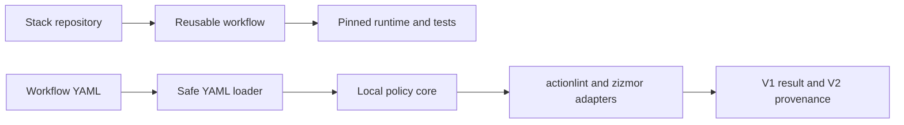

# CI/CD Templates: Reusable, Security-Gated GitHub Actions Workflows

**Five reusable workflows (Python, Go, Node, JVM/Gradle, Terraform) with an offline security gate:** `0` findings in the templates, `7/7` expected findings caught in unsafe fixtures, and `104.945 ms` median scan latency across `3` measured runs after `1` warm-up.

[](https://github.com/Brilhante29/ci-cd-templates/actions/workflows/ci.yml)
[](LICENSE)


## Why this exists

CI pipelines are code with production credentials attached, and they are usually copy-pasted between repositories. Every copy drifts, and the common mistakes are security mistakes: actions pinned to mutable tags, `write-all` permissions, checkout credentials left on disk, `pull_request_target` running untrusted code, or event fields interpolated straight into shell commands. This repository centralizes the pipelines and guards them:

- one reusable workflow per stack, each exercised by this repository's own CI against a minimal fixture;
- every external action pinned to a full commit SHA, read-only permissions, no persisted credentials, bounded jobs;
- a scanner (local policies plus actionlint and offline zizmor) that must find **zero** problems in the templates and **all seven** planted problems in unsafe fixtures, so a broken scanner cannot pass silently;
- everything runs offline in a non-root container with no token.

## Results

| Result | Value |
|---|---:|
| Median scan latency | `104.945 ms` |
| Range | `103.531-152.502 ms` |
| Scanned files | `9` (`3` fixtures + `6` workflows) |
| Unsafe-fixture findings | `7/7` |
| Template findings | `0` |

**How to read it:** `scan_time_ms` measures one deterministic pass over the policy fixtures and all reusable workflow files; `findings` and `template_findings` are correctness gates, and they are the result that matters. The benchmark measures static validation latency, not the hosted duration of consumer builds: actual template execution is proved by the exact-head GitHub Actions jobs, because build duration belongs to the consuming stack and runner.

The [V1 result](benchmarks/results/guardrails-baseline.json) and [V2 publication record](benchmarks/publication/guardrails-baseline-v2.json) bind these numbers to source commit `8bfd94a1a8fd6186b717bc7be53d61e92d419b2d` and image digest `sha256:c075a917595faf3e84c5189306eb59c422e051cabaefbc6ea7f75b46d58ae70f`.

## Quickstart

```bash
docker build -t ci-cd-templates .
docker run --rm --network none ci-cd-templates
docker run --rm --network none ci-cd-templates validate --strict
docker run --rm --network none ci-cd-templates benchmark --no-external --stdout
```

The default container runs as UID `10001`, has no token or network requirement, and scans the six files under `.github/workflows` with local policy, actionlint, and offline zizmor adapters.

Consume a workflow by immutable source commit:

```yaml
jobs:
  verify:
    uses: Brilhante29/ci-cd-templates/.github/workflows/reusable-python.yml@8bfd94a1a8fd6186b717bc7be53d61e92d419b2d
```

## How it works



The reusable workflows and the Python scanner share contracts, not source code. Models and policies do not import CLI, subprocess, Docker, or GitHub APIs. Scanner composition depends inward; analyzer processes remain adapters.

### Reusable workflows

| Workflow | Runtime | Executed proof |
|---|---|---|
| `reusable-python.yml` | Python `3.12.13` | Ruff, mypy, unittest, coverage `>=90%` |
| `reusable-go.yml` | Go `1.26.0` | gofmt and `go test ./...` |
| `reusable-node.yml` | Node `24.13.0` | lockfile install and native tests |
| `reusable-jvm-gradle.yml` | Java `21`, Gradle `9.3.1` | isolated Gradle `check` |
| `reusable-terraform.yml` | Terraform `1.14.8` | format, offline init, validate |

Every external action is pinned to a full commit SHA. Checkout persistence is disabled, permissions are read-only, jobs are time-bounded, and the repository's own CI calls all five workflows: the Python workflow against this repository's scanner, the others against minimal fixtures in [`examples/`](examples).

### Guardrail contract

- Parse YAML safely and preserve source locations.
- Require workflow name, trigger, jobs, least-privilege permissions, and bounded executable jobs.
- Require full 40-character SHAs for actions and remote reusable workflows.
- Reject `pull_request_target`, `write-all`, persisted checkout credentials, inline credentials, and untrusted event interpolation in shell commands.
- Keep local reusable-workflow calls valid while enforcing timeout inside the called workflow.

The three policy fixtures intentionally contain `5` high and `2` medium findings. The five reusable workflows must produce zero findings; the benchmark fails closed when they do not.

## Design decisions

| Decision | Why | Rejected |
|---|---|---|
| A pipeline architecture | A scan is a naturally ordered pipeline from files to parsed documents, policies, optional analyzers, and a stable report | Microservices (deployment and network failure modes for a local static-analysis problem); a clean-architecture service (no transport or persistence boundary worth introducing) |
| A Python CLI | A typed, testable CLI while YAML and Docker stay explicit integration boundaries | A Rust CLI: strong binary distribution, but slower iteration on policy fixtures |
| A local scanner plus reusable workflows | The same deterministic scan runs locally and in CI | An action-only composite workflow, which cannot run without GitHub Actions |
| Planted findings as a correctness gate | A broken scanner that reports nothing cannot pass | Trusting an empty report |

SRP separates parsing, policy, tools, orchestration, benchmark, and transport. LSP is not claimed because no inheritance hierarchy exists. KISS and YAGNI exclude a server, database, broker, cloud account, and automatic workflow mutation.

## Limitations

- The scan latency describes static validation of nine files, not the duration of consumer builds.
- The policies cover the listed guardrails; they do not replace a full supply-chain review of every consumed action.
- Execution of each template is proved only against this repository's scanner and the minimal fixtures in `examples/`.

## Reproducibility

1. Build the image and run `docker run --rm --network none ci-cd-templates benchmark --no-external --stdout`.
2. Compare the output with the [V1 result](benchmarks/results/guardrails-baseline.json) and the [V2 publication record](benchmarks/publication/guardrails-baseline-v2.json).
3. The protocol is in [`sdd/benchmark-plan.md`](sdd/benchmark-plan.md); the architecture and stack decisions are in [`sdd/architecture-decision.md`](sdd/architecture-decision.md) and [`sdd/technical-decision.md`](sdd/technical-decision.md).

## Project structure

```text
.github/workflows/            CI plus the five reusable workflows
src/ci_guardrails/            YAML loader, policies, tool adapters, scanner, benchmark, CLI
tests/                        unit tests for loader, models, policies, scanner, tools, benchmark
benchmarks/fixtures/          secure, malformed, and policy-violation workflow fixtures
benchmarks/results/           V1 benchmark result
benchmarks/publication/       V2 publication record
examples/                     minimal Go, Node, JVM, and Terraform fixtures exercised by CI
tools/                        V2 producer and project validators
sdd/                          decisions, benchmark plan, reuse review
```

## How this repository is built

The project follows the spec-driven workflow of [portfolio-reuse-kit](https://github.com/Brilhante29/portfolio-reuse-kit). Requirements and decisions live in [`sdd/`](sdd) and [`openspec/`](openspec), and [`project.yaml`](project.yaml) records the architecture, stack, and rejected alternatives. Development is AI-assisted and human-governed: [`AGENTS.md`](AGENTS.md) and [`CLAUDE.md`](CLAUDE.md) hold the coding-agent instructions, while tests, validators, and CI decide what gets published.

## Related work

- [terraform-aws-baseline](https://github.com/Brilhante29/terraform-aws-baseline): infrastructure validated by the Terraform profile.
- [load-test-suite](https://github.com/Brilhante29/load-test-suite): CI smoke benchmarks kept separate from committed evidence.
- [portfolio-reuse-kit](https://github.com/Brilhante29/portfolio-reuse-kit): the shared standard these templates serve.

See [`REFERENCES.md`](REFERENCES.md) for sources and licenses.

## Author

**Guilherme Brilhante**, software engineer working on scalable backends and production AI.
[LinkedIn](https://www.linkedin.com/in/guilhermefreirebrilhanteseveriano/) · [GitHub](https://github.com/Brilhante29) · [Publications](https://dblp.org/pid/353/6812.html)

## License

[MIT](LICENSE).
